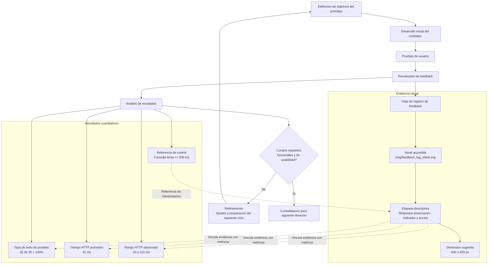
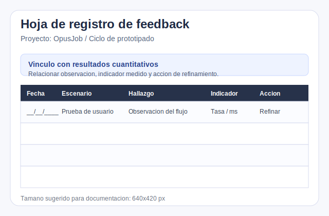

# Documentación Técnica (OpusJob)

## Arquitectura
- Patrón MVC simple con front controller en [index.php](file:///c:/xampp/htdocs/pegaTinder/public/index.php) y router en [App.php](file:///c:/xampp/htdocs/pegaTinder/app/core/App.php).
- Controladores en [controllers](file:///c:/xampp/htdocs/pegaTinder/app/controllers), modelos en [models](file:///c:/xampp/htdocs/pegaTinder/app/models) y vistas en [views](file:///c:/xampp/htdocs/pegaTinder/app/views).

## Seguridad
- CSRF:
  - Token por sesión: [security_helper.php](file:///c:/xampp/htdocs/pegaTinder/app/helpers/security_helper.php)
  - Inyectado en formularios: [login.php](file:///c:/xampp/htdocs/pegaTinder/app/views/users/login.php), [register.php](file:///c:/xampp/htdocs/pegaTinder/app/views/users/register.php), [profile.php](file:///c:/xampp/htdocs/pegaTinder/app/views/users/profile.php)
  - Usado en AJAX: `window.CSRF_TOKEN` + `X-CSRF-Token` en [header.php](file:///c:/xampp/htdocs/pegaTinder/app/views/inc/header.php)
- XSS:
  - Escape centralizado `esc()` en [security_helper.php](file:///c:/xampp/htdocs/pegaTinder/app/helpers/security_helper.php)
  - Aplicado a salida en [header.php](file:///c:/xampp/htdocs/pegaTinder/app/views/inc/header.php) y [profile.php](file:///c:/xampp/htdocs/pegaTinder/app/views/users/profile.php)

## Logs y Manejo de Errores
- Logger (JSON lines) en [Logger.php](file:///c:/xampp/htdocs/pegaTinder/app/core/Logger.php) escribe en `logs/app.log`.
- Handler global en [ErrorHandler.php](file:///c:/xampp/htdocs/pegaTinder/app/core/ErrorHandler.php) captura errores/excepciones y:
  - Responde JSON en endpoints AJAX/JSON
  - Responde HTML genérico en páginas
- Registro automático en [init.php](file:///c:/xampp/htdocs/pegaTinder/app/init.php).

## Rendimiento
- Paginación de “feed”:
  - Empleos: `GET /empleos/feed?limit=12&offset=0` en [Home.php](file:///c:/xampp/htdocs/pegaTinder/app/controllers/Home.php)
  - Candidatos: `GET /candidatos/feed?limit=12&offset=0` en [Recruiter.php](file:///c:/xampp/htdocs/pegaTinder/app/controllers/Recruiter.php)
  - JS carga incremental cuando quedan pocas tarjetas: [main.js](file:///c:/xampp/htdocs/pegaTinder/public/js/main.js), [recruiter.js](file:///c:/xampp/htdocs/pegaTinder/public/js/recruiter.js)
- Índices BD: script [optimize_db.php](file:///c:/xampp/htdocs/pegaTinder/optimize_db.php)
- Consultas lentas: `db_slow_query` (>200ms) en [Database.php](file:///c:/xampp/htdocs/pegaTinder/app/core/Database.php)

## Pruebas
- Runner simple:
  - Ejecutar: `c:\xampp\php\php.exe c:\xampp\htdocs\pegaTinder\tests\run.php`
  - Tests: [tests](file:///c:/xampp/htdocs/pegaTinder/tests)
- Nota sobre cobertura:
  - Cobertura automática requiere Xdebug (no se asume instalado).

## Resolución: Ofertas no visibles al cambiar de rol
- Síntoma: una cuenta que publicó ofertas como reclutador no las veía al iniciar sesión con rol `user`.
- Causa raíz: ofertas antiguas podían quedar con `jobs.recruiter_id = NULL`, por lo que no aparecían en listados por cuenta (`WHERE recruiter_id = :user_id`).
- Correcciones:
  - Endpoint por cuenta (autenticado) `GET /Users/myAccountJobsData` para cargar ofertas sin depender del rol de sesión: [Users.php](file:///c:/xampp/htdocs/pegaTinder/app/controllers/Users.php).
  - Backfill automático “best-effort” para vincular ofertas huérfanas (`recruiter_id IS NULL`) a la cuenta cuando `company` coincide con el nombre de sesión: [Job.php](file:///c:/xampp/htdocs/pegaTinder/app/models/Job.php).
  - Acceso a “Mis ofertas / Crear oferta” desde rol `user` (UI y controlador), manteniendo `candidatos` y `reclutamiento` como funciones exclusivas de reclutador: [header.php](file:///c:/xampp/htdocs/pegaTinder/app/views/inc/header.php), [Recruiter.php](file:///c:/xampp/htdocs/pegaTinder/app/controllers/Recruiter.php).

## Resolución: Solo se veían 2 oportunidades en Empleos
- Síntoma: en “Empleos” se mostraban solo 1–2 oportunidades (típicamente las que contenían “Remoto”), pero no aparecían oportunidades nuevas.
- Causa raíz: el feed filtraba estrictamente por `user_location` (`WHERE ... AND (location LIKE :location OR location LIKE '%Remoto%')`), por lo que cualquier oferta fuera de esa cadena no se devolvía (ej: ubicación distinta, “Híbrido”, etc.).
- Corrección: el feed deja de filtrar por ubicación y pasa a **ordenar por relevancia** (primero cercanas/remotas, luego el resto), manteniendo `status='published'`: [Job.php](file:///c:/xampp/htdocs/pegaTinder/app/models/Job.php).

## Resolución: Reclutador no veía postulantes de su oferta
- Síntoma: un usuario postulaba a una oferta, la postulación quedaba registrada, pero el panel de reclutador no mostraba ese postulante.
- Causa raíz: el flujo de postulación del candidato persistía en `job_likes`, mientras que el pipeline del reclutador consultaba solo `candidate_likes` y `candidates`.
- Correcciones:
  - `job_likes` ahora soporta `status` y `updated_at` para seguimiento de candidatura.
  - El pipeline combina candidatos guardados (`candidate_likes`) y postulaciones reales (`job_likes + jobs + users`).
  - `Recruiter::pipelineUpdate` soporta dos tipos de entrada: `candidate` y `job_applicant`.
  - Se registra auditoría `job_application_created` al completar una postulación.
  - El panel muestra un mensaje específico cuando no hay resultados por filtros activos.

## Stress / Concurrencia
- Script HTTP concurrente: [stress.php](file:///c:/xampp/htdocs/pegaTinder/scripts/stress.php)
- Ejemplo:
  - `c:\xampp\php\php.exe c:\xampp\htdocs\pegaTinder\scripts\stress.php http://localhost/pegaTinder /empleos 10 100`

## Diagrama Mermaid: Prototipado, Resultados Cuantitativos y Evidencia Visual
- Indicadores verificados del proyecto:
  - Tasa de exito de pruebas: `35/35` (`100%` aprobado)
  - Tiempo HTTP promedio medido: `31 ms`
  - Rango HTTP observado: `20-122 ms`
  - Umbral de referencia para consulta lenta: `>=200 ms`
- Evidencia visual asociada:
  - Hoja de feedback: [feedback_log_sheet.svg](file:///c:/xampp/htdocs/pegaTinder/public/img/feedback_log_sheet.svg)
  - Ruta relativa web: `/img/feedback_log_sheet.svg`
  - Dimensiones preparadas para documentacion: `640x420 px`

### Renderizado recomendado
- El bloque anterior usa solo sintaxis `flowchart` portable para evitar errores en GitHub, Notion y Mermaid Live Editor.
- Mermaid no incrusta imagenes locales de forma uniforme en todas las plataformas, por lo que el diagrama referencia el asset y la evidencia visual se inserta debajo como recurso complementario.
- Si se publica en la aplicacion o en un markdown renderizado con acceso al proyecto, usar la ruta `/img/feedback_log_sheet.svg`.

